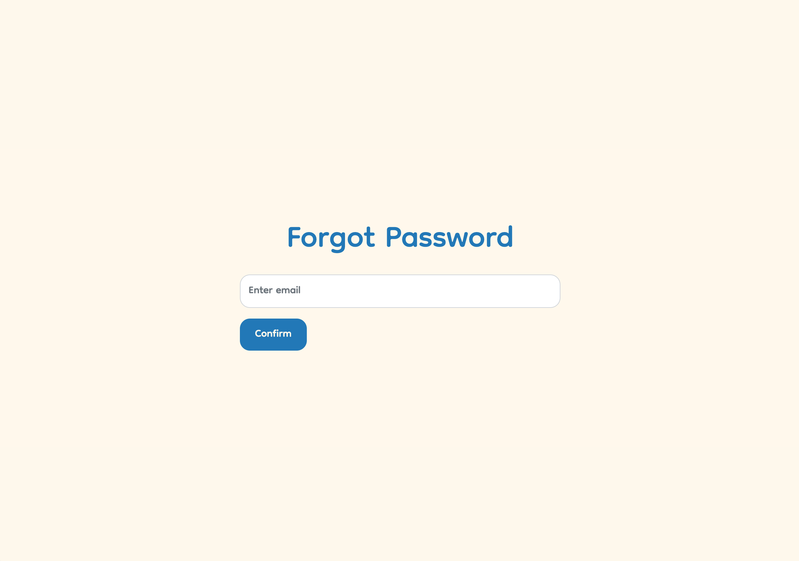

# Built with:

- React.js
- TypeScript
- Bootstrap
- NestJS

### Authentification screen:
Features:
- Register
- Log In
- Reset the password

### Todos screen:
Features:
- Create, update, delete lists
- Create, update, mark as completed, delete tasks
- Log Out to change account

### Confirm Email screen:
User will receive a "Confirm email" link in the mail app

### Forgot Email screen:
User can reset the password if he forgot it. He will receive a link in the main app

